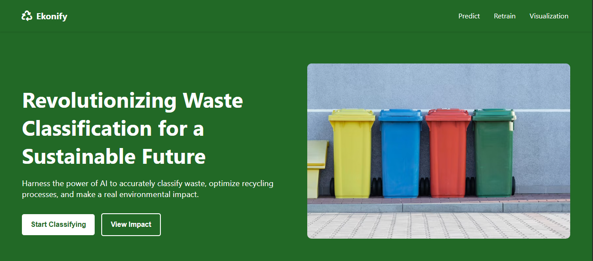

# Ekonify-MLOP
here, I'll be creating an ML Pipeline, scaling and monitoring it on a cloud platform of my choice for my Ekonify project (A platform for Waste Classification and Recycling Optimisation) 

This project is an AI-powered platform designed for image classification with a built-in functionality to retrain the model based on new data stored in a MongoDB database.



## Features
- Upload images and store metadata in MongoDB
- Retrieve images for training or retraining
- Trigger model retraining using new data
- API endpoints for CRUD operations

## Technologies Used
- Python (Backend & Model Training)
- FastAPI (API Development)
- MongoDB (Database)
- PyTorch / TensorFlow (Model Training)
- pymongo (MongoDB Integration)

## Installation
1. Clone the repository:
   ```bash
   git clone https://github.com/eadewusic/Ekonify-MLOP.git
   ```

2. Install dependencies:
   ```bash
   pip install -r requirements.txt
   ```

3. Set up your MongoDB:
   - Make sure MongoDB is installed and running locally or use a cloud MongoDB instance (e.g., MongoDB Atlas).
   - Update the connection string in `database.py` accordingly.

## Usage
1. Start the API server:
   ```bash
   python app.py
   ```

2. Use a tool like Postman or Curl to interact with the API endpoints.

## API Endpoints
- `POST /upload`: Upload an image and save metadata to MongoDB.
- `GET /images`: Retrieve all images.
- `GET /images/<id>`: Retrieve a specific image by ID.
- `PUT /images/<id>`: Update an image's metadata.
- `DELETE /images/<id>`: Delete an image.
- `POST /retrain`: Trigger model retraining with new data.

## Model Retraining
1. Images marked for retraining are retrieved from the database using the `retrieve_for_retraining()` function.
2. The model is retrained with the new dataset and updated accordingly.
3. The updated model is saved for future use.

## Deployment
- Ekonify Front-End: See it on [Render](https://ekonify-frontend.onrender.com)
- Ekonify API: See it on [Railway](https://railway.com/)

## Video Presentation
Watch my demo video [here](https://www.youtube.com/@climiradiroberts) 

## Initial Repo for Model Training
See it here - https://github.com/eadewusic/Ekonify.git